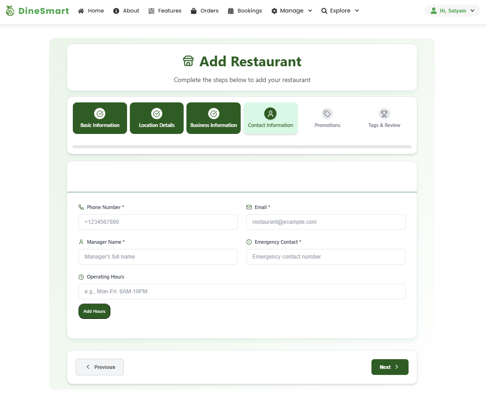
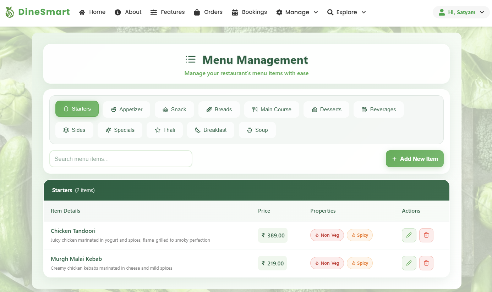

# DineSmart - Smart Restaurant Discovery & Food Ordering Platform

<div align="center">
  
 
</div>

## 📖 Overview

**DineSmart** is a comprehensive, full-stack restaurant discovery and food ordering platform that revolutionizes how customers find restaurants and how owners manage their business. Built with the MERN stack, it features intelligent filtering, real-time order tracking, secure authentication, and role-based access control.

### 🎯 Key Highlights

-- **Fully Role-Based Single Page Application (SPA)**  
 Supports different user roles with tailored interfaces and access control, including customers and restaurant owners.

- **Advanced Filtering, Searching, and Sorting**  
  Helps users quickly find restaurants and menu items based on multiple criteria for an optimized discovery experience.

- **Nutritional Tagging, Allergen Information & Dietary Filters**  
  Menus display detailed nutritional and allergen info, allowing users to filter dishes according to dietary preferences and restrictions.

- **Integrated Coupon & Discount System**  
  Real-time price updates during ordering reflect applied coupons and discounts seamlessly.

- **Realistic User Journey for Dine-In and Delivery**  
  Comprehensive flow covering browsing, ordering, payment, and order tracking for both dine-in and delivery services.

- **Dynamic Restaurant Dashboard for Owners**  
  Provides analytics, order management, and operational insights to help restaurant owners optimize their services.

---

## 🚀 Live Demo

🌐 **[Try DineSmart Live](https://dinesmart-demo.com)**

### Demo Credentials

## 📱 Images

## 🔐 Authentication Screens

<div align="center" style="margin-bottom: 20px;">
  
  
  
  <p><em>Login, Sign Up and Forgot Password</em></p>
</div>

---

## 🏠 Homepage

<div align="center" style="margin-bottom: 20px;">
  
  <p><em>Smart restaurant discovery and navigation</em></p>
</div>

---

## 🍽️ Customer View – Menu & Ordering

<div align="center" style="margin-bottom: 20px;">
  
  
  <p><em>Menu browsing with detailed items and options</em></p>
</div>

<div align="center" style="margin-bottom: 20px;">
  
  
  <p><em>Cart overview and secure 3-step payment integration</em></p>
</div>

---

## 📦 Orders & Bookings

<div align="center" style="margin-bottom: 20px;">
  
  
  <p><em>View order history and real-time tracking</em></p>
</div>

<div align="center" style="margin-bottom: 20px;">
  
  
  <p><em>Table booking and reservation tracking</em></p>
</div>

---

## 🧑‍🍳 Owner Dashboard & Management

<div align="center" style="margin-bottom: 20px;">
  
  
  <p><em>Owner: Add and manage restaurants</em></p>
</div>

<div align="center" style="margin-bottom: 20px;">
  
  
  
  <p><em>Owner: Manage menus, orders, and bookings</em></p>
</div>

<div align="center" style="margin-bottom: 20px;">
  
  <p><em>Dashboard overview with stats and controls</em></p>
</div>


---

## ✨ Features

### 👤 **Customer Experience**

#### 🔐 **Authentication & Security**

- **Multi-role Signup**: Customer and Restaurant Owner registration
- **Secure Login**: Email/password with alphanumeric CAPTCHA verification
- **Password Recovery**: Email-based OTP verification for password reset
- **Profile Management**: Update personal details and notification preferences

#### 🏠 **Smart Home Page**

- **Interactive Food Carousel**: Stunning zoom effects showcasing featured dishes
- **Intelligent Search**: Find restaurants by dish name, location, or cuisine
- **Advanced Filtering System**:
  - 📍 Location-based (current location + 10km radius)
  - 🥬 Dietary preferences (Veg/Jain options)
  - 💰 Price range filtering
  - ⭐ Ratings and reviews
  - 🍜 Cuisine type selection
  - ⏱️ Delivery time estimation
  - 📊 Smart sorting (price/rating: high-to-low, low-to-high)

#### 🍽️ **Restaurant & Menu Management**

- **Detailed Restaurant Cards**: Promotions, ratings, and key information
- **Comprehensive Menu View**:
  - Categorized menu items for easy navigation
  - Nutritional filtering (proteins, carbs, fats, calories)
  - Ingredient and allergen information
  - Cuisine type indicators (spicy, sweet, etc.)
  - Customer ratings and reviews
- **Smart Menu Search**: Find items by name, ingredients, or cuisine type

#### 🛒 **Shopping & Ordering**

- **Intelligent Cart System**:
  - Single restaurant ordering (auto-clear for different restaurants)
  - Real-time item count in navbar
  - Quantity management and price calculation
- **3-Step Secure Checkout**:
  1. **Order Review**: Apply DineSmart offers and promotional coupons
  2. **Payment Options**: Card, UPI, or Cash on Delivery
  3. **Order Confirmation**: Downloadable PDF receipt

#### 📦 **Order Management**

- **Real-time Order Tracking**: Live status updates from preparation to delivery
- **Order History**: Filter by date, restaurant, status, or order details
- **Order Status Tracking**:
  - Preparing → Out for Delivery → Delivered
  - Estimated delivery time with restaurant contact info
- **Smart Filters**: Search orders by multiple criteria

#### 🪑 **Table Reservation System**

- **Easy Booking Process**: Select guests, date, time with zero booking fee
- **Booking Management**:
  - Current and past reservations
  - Cancellation up to 2 hours before booking time
  - Downloadable booking confirmation PDF
- **Flexible Filtering**: Filter bookings by date, time, restaurant, or status

### 🧑‍🍳 **Restaurant Owner Dashboard**

#### 🏪 **Restaurant Management**

- **Complete Restaurant Profile**:
  - Business details, location, cuisine type
  - Contact information and descriptions
  - Achievement showcases
  - Promotional offer management
- **Dynamic Promotions**:
  - Create/edit promotional coupons
  - Set validity periods and discount percentages
  - Activate/deactivate promotions instantly

#### 📋 **Menu Management System**

- **Category-based Organization**: Structured menu layout
- **Comprehensive Item Details**:
  - Item name, cuisine type, images
  - Detailed ingredient lists
  - Allergen information
  - Complete nutritional data
  - Pricing and descriptions
- **Bulk Management**: Table view for easy menu item editing and removal

#### 📊 **Business Analytics**

- **Performance Dashboard**: Revenue, ratings, and trend analysis
- **Order Analytics**: Track order volume and patterns
- **Customer Insights**: Understanding customer preferences

#### 🛎️ **Order & Booking Management**

- **Real-time Order Processing**:
  - Filter orders by status, date, and details
  - Update order status instantly
  - View complete order information
  - Order count dashboard (total, pending, completed, preparing)
- **Table Booking Management**:
  - View all reservations with detailed customer information
  - Update booking status
  - Filter bookings by multiple criteria

### 🔄 **Role-Based Access Control**

- **Dynamic Navigation**: Role-specific menu items and features
- **Secure Route Protection**: Access control based on user roles
- **Customized UI Components**: Different layouts for customers vs owners

### 📱 **Universal Features**

- **Responsive Design**: Optimized for desktop, tablet, and mobile
- **Settings Management**: Profile updates and notification controls
- **Help & Support**: FAQ, Terms & Conditions, Contact Us, About Us
- **Smart Footer**: Role-based information display

---

## 🛠️ Tech Stack

### **Frontend**

| Technology   | Purpose             | Version |
| ------------ | ------------------- | ------- |
| React        | UI Framework        | 18.2.0+ |
| React Router | Client-side Routing | 6.8.0+  |
| CSS Modules  | Styling             | -       |
| Axios        | HTTP Client         | 1.3.0+  |
| Lucide React | Icons               | Latest  |

### **Backend**

| Technology | Purpose             | Version |
| ---------- | ------------------- | ------- |
| Node.js    | Runtime Environment | 18.0+   |
| Express.js | Web Framework       | 4.18.0+ |
| MongoDB    | Database            | 6.0+    |
| Mongoose   | ODM                 | 7.0+    |
| JWT        | Authentication      | 9.0+    |

### **Additional Tools**

- **Security**: Bcrypt, CAPTCHA, Express Validator
- **Communication**: Nodemailer for email services
- **Authentication**: Admin SDK
- **Development**: dotenv, cors, nodemon

---

## 🚀 Quick Start

### Prerequisites

```bash
Node.js >= 18.0.0
MongoDB >= 6.0.0
npm or yarn package manager
```

### 1. Clone the Repository

```bash
git clone https://github.com/yourusername/dinesmart.git
cd dinesmart
```

### 2. Install Dependencies

```bash
# Install backend dependencies
npm install

# Install frontend dependencies
cd frontend
npm install
cd ..
```

### 3. Environment Setup

Create a `.env` file in the root directory:

```env
# Database
MONGODB_URI=mongodb://localhost:27017/dinesmart
MONGODB_TEST_URI=mongodb://localhost:27017/dinesmart_test

# JWT & Security
JWT_SECRET=your_super_secure_jwt_secret_key_here
JWT_EXPIRE=7d
BCRYPT_SALT_ROUNDS=12

# Email Configuration (Nodemailer)
EMAIL_SERVICE=gmail
EMAIL_USER=your-email@gmail.com
EMAIL_PASS=your-app-specific-password


# Application Settings
PORT=5000
NODE_ENV=development
CLIENT_URL=http://localhost:3000

# CAPTCHA Configuration
CAPTCHA_SECRET=your-captcha-secret-key

```

### 4. Database Setup

```bash
# Start MongoDB service
mongod

# Seed the database with sample data (optional)
cd backend
cd config
node seed.js
```

### 5. Start the Application

```bash
# Start backend server (runs on port 5000)
cd backend
nodemon index.js

# In a new terminal, start frontend (runs on port 3000)
cd frontend
npm start


````

## 🔌 API Documentation

### Authentication Endpoints

```http
POST /api/auth/createuser        # User registration
POST /api/auth/login             # User login
POST /api/auth/logout            # User logout
POST /api/auth/forgot-password   # Password reset request
POST /api/auth/reset-password    # Password reset confirmation
GET  /api/auth/verify-token      # Token verification
```

### Customer Endpoints

```http
GET    /api/restaurants          # Get all restaurants
GET    /api/restaurants/:id      # Get restaurant details
GET    /api/restaurants/:id/menu # Get restaurant menu
POST   /api/orders               # Create new order
GET    /api/orders               # Get user orders
GET    /api/orders/:id           # Get order details
PUT    /api/orders/:id/status    # Update order status
POST   /api/bookings             # Create table booking
GET    /api/bookings             # Get user bookings
PUT    /api/bookings/:id         # Update booking
DELETE /api/bookings/:id         # Cancel booking
```

### Owner Endpoints

```http
POST   /api/owner/restaurants    # Create restaurant
PUT    /api/owner/restaurants/:id # Update restaurant
GET    /api/owner/restaurants    # Get owned restaurants
POST   /api/owner/menu           # Add menu item
PUT    /api/owner/menu/:id       # Update menu item
DELETE /api/owner/menu/:id       # Delete menu item
GET    /api/owner/orders         # Get restaurant orders
PUT    /api/owner/orders/:id     # Update order status
GET    /api/owner/bookings       # Get restaurant bookings
POST   /api/owner/coupons        # Create coupon
PUT    /api/owner/coupons/:id    # Update coupon
```

---

## 🤝 Contributing

We welcome contributions! Please see our [Contributing Guidelines](CONTRIBUTING.md) for details.

### Development Workflow

1. Fork the repository
2. Create a feature branch (`git checkout -b feature/amazing-feature`)
3. Commit your changes (`git commit -m 'Add amazing feature'`)
4. Push to the branch (`git push origin feature/amazing-feature`)
5. Open a Pull Request

### Code Standards

- Write meaningful commit messages
- Add tests for new features
- Update documentation as needed

---

## 🙏 Acknowledgments

- Inspiration from modern food delivery platforms like zomato and swiggy.
- Open source community for amazing tools and libraries

---
